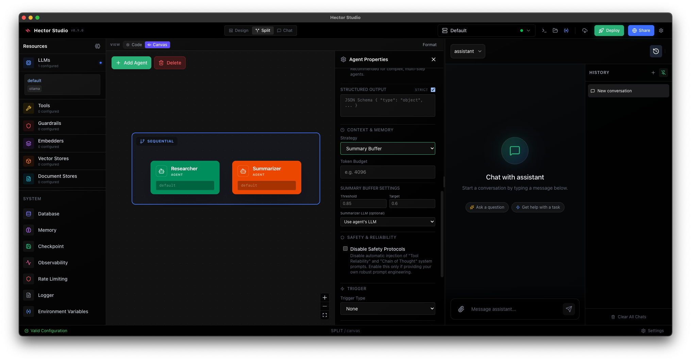

# Hector Studio (Desktop)

The native desktop GUI for Hector. Design agents visually, manage workspaces, and monitor execution in real-time.

[](https://github.com/verikod/hector-studio)

[**Download Hector Studio**](https://github.com/verikod/hector-studio/releases) for macOS, Windows, and Linux.

## Overview

**Hector Studio** is a comprehensive IDE for AI agents. It effectively turns your local machine into a powerful development environment ("Docker Desktop for Agents") while also serving as an interface for remote Hector instances.

### Key Features

- **Visual Flow Builder**: Design agent architectures using a drag-and-drop canvas. Bi-directional sync updates your `config.yaml` automatically.
- **Resource Management**: Configure LLMs, Vector Stores, Databases, and Guardrails via a dedicated sidebar UI—no manual YAML editing required.
- **Workspace Isolation**: Switch instantly between different projects (folders). Each workspace gets its own isolated Hector server instance.
- **Integrated Chat**: Test agents immediately within the studio. Supports streaming responses, tool execution visualization, and markdown rendering.
- **Real-time Observability**: Built-in "Log Drawer" provides live streaming logs from the Hector background process for debugging.
- **One-Click Setup**: Automatically detects or downloads the correct `hector` binary version for your OS.

## Visual Config Builder

The Visual Builder is the heart of Hector Studio. It provides two views:

1.  **Canvas View**: A node-based editor for defining Agents and their relationships.
    *   **Add Agents**: Click "Add Agent" to drop a new agent node.
    *   **Edit Properties**: Select a node to configure its Role, Instruction, and Model.
    *   **Auto-Layout**: Nodes are automatically arranged for clarity.

2.  **Infrastructure Sidebar**: A managed inventory of your shared resources.
    *   **LLMs**: Define provider configs (OpenAI, Anthropic, Ollama).
    *   **Tools**: Enable and configure tools (Search, FileSystem, Database).
    *   **Guardrails**: Set up input/output validation rules.
    *   **Memory**: Configure Vector Stores (e.g., Chromem) and Embedders.

> [!TIP]
> Changes made in the Visual Builder are immediately written to your `config.yaml` file. Conversely, editing the file manually updates the UI in real-time.

## Workspaces & Environment

Hector Studio manages **Workspaces**, which map to local directories containing a `config.yaml`.

*   **Local Mode**: Point Studio to a folder. It spins up a managed `hector serve` process in the background.
*   **Remote Mode**: Connect to a running production server (e.g., `https://agents.company.com`). Studio acts as a remote client.

## Connecting to Remote Servers

Studio can manage remote Hector instances, strictly separating configuration (read-only for security) from observation.

### Option 1: No Authentication (Development)

For internal dev servers:

1.  Start server: `hector serve --host 0.0.0.0 --studio`
2.  In Studio: Click **Server Selector** -> **Add Remote Server**.
3.  Enter URL: `http://<server-ip>:8080`.

### Option 2: Authenticated (Production)

For secure production environments:

**Server Setup:**
```bash
hector serve --config config.yaml \
  --studio \
  --studio-roles admin,operator \
  --auth-required \
  --auth-jwks-url https://auth.company.com/.well-known/jwks.json \
  --auth-issuer https://auth.company.com/ \
  --auth-audience hector-api
```

**Studio Connection:**
1.  Add Remote Server with your production URL.
2.  Studio will prompt for authentication via your Identity Provider.
3.  Once authenticated, you gain access based on your role (e.g., `operator` can view logs/chat, `admin` might have more privileges).


