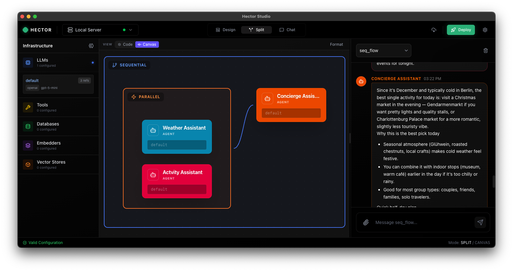

# Hector Studio (Desktop)

The native desktop GUI for Hector. Manage your agents and workspaces with a rich visual interface.

[](https://github.com/verikod/hector-studio)

[**Download Hector Studio**](https://github.com/verikod/hector-studio/releases) for macOS, Windows, and Linux.

## Overview

**Hector Studio** is a standalone desktop application that provides a Docker Desktop-like experience for managing your AI agents. It eliminates the need to restart servers manually or manage complex background processes.

### Key Features

- **Workspace Management**: Create and switch between different agent project folders instantly.
- **One-Click Installation**: Checks for and downloads the `hector` binary automatically.
- **Visual Config Editor**: Edit `agents.yaml` with schema validation and real-time error checking.
- **Interactive Chat**: Test your agents with streaming responses, markdown support, and tool visualization.
- **Tray Integration**: Runs quietly in the background; access your agents from the menu bar/system tray.
- **Multiple Environments**: Manage local workspaces and connect to remote production servers from one UI.

## Getting Started

1. **Download and Install** Hector Studio from the [releases page](https://github.com/verikod/hector-studio/releases).
2. **Launch the App**. It will automatically check for the `hector` binary.
3. **Create a Workspace**:
   - Click the folder icon or "Add Workspace".
   - Select a directory where you want your agent configuration (or an existing project).
   - Hector Studio will initialize the server in that directory.

## Connecting to Remote Servers

While Hector Studio is designed for local development, it can also connect to remote Hector instances.

### Option 1: No Authentication (Development/Internal)

For internal networks or development servers where authentication is not required.

**Server Setup:**
Start your server with the `--studio` flag to enable the API.

```bash
hector serve --config agents.yaml --studio --host 0.0.0.0
```

**Studio Connection:**
1. Click **Add Server** -> **Remote Server**.
2. Enter the Name (e.g., "Dev Server") and URL (e.g., `http://192.168.1.50:8080`).
3. Click **Connect**.

### Option 2: Authenticated (Production)

For public or shared servers, you should enable authentication to prevent unauthorized access.

**Server Setup:**
Enable JWT authentication and specify allowed roles for Studio access.

```bash
hector serve --config agents.yaml \
  --studio \
  --studio-roles admin,operator \
  --auth-required \
  --auth-jwks-url https://auth.company.com/.well-known/jwks.json \
  --auth-issuer https://auth.company.com/ \
  --auth-audience hector-api
```

**Studio Connection:**
1. Click **Add Server** -> **Remote Server**.
2. Enter the Name (e.g., "Production") and URL (e.g., `https://agent.company.com`).
3. Click **Connect**.
4. You will be redirected to your identity provider to log in.
